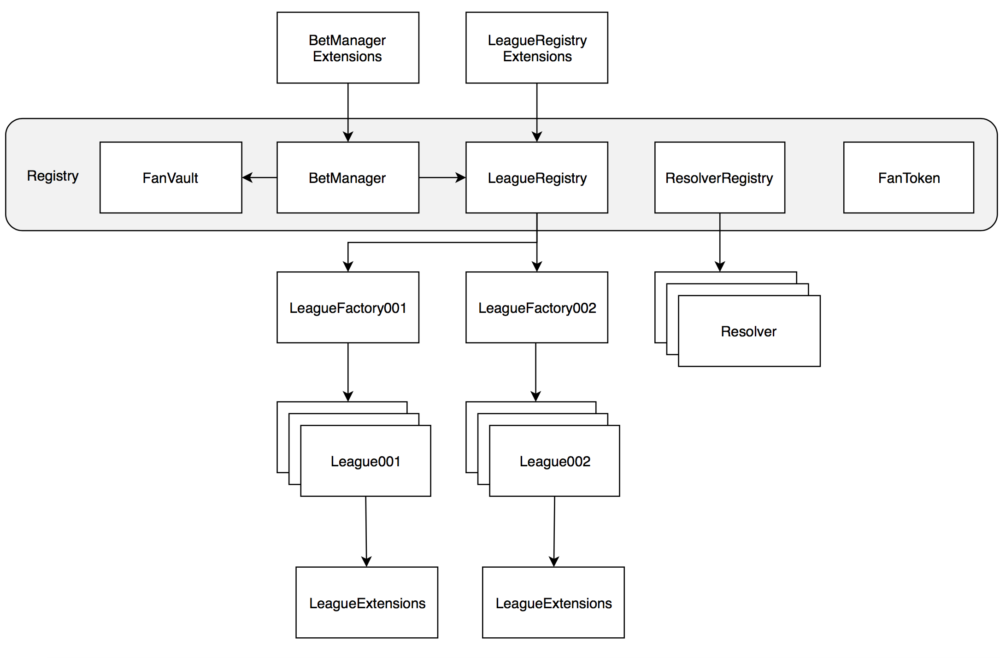

[](https://travis-ci.org/fansunite/fansunite-core)
[](https://coveralls.io/github/fansunite/fansunite-core?branch=development)


# Fansunite Core

Fansunite Core defines a protocol to facilitate trustless wagering of any ERC20 token for any sport events. The resolution of wagers and the provision of event data is crowd-sourced by a decentralized network of oracles incentivised to provide low-latency and accurate sports data. The FansUnite protocol will serve as the building blocks for decentralized applications (DApps) that span traditional bookmaking, betting exchanges, and a variety of other services reliant on sports data.

# The Fansunite Core Architecture
The diagram below depicts a high-level view of the various modules, registries, and contracts implemented in FansUnite Core:



## Components

### FanVault
The Vault manages the deposits, withdrawals and transfers of ERC20 tokens and Ether over the FansUnite Protocol. The Vault and approved spenders (BetManager) together manage the exposure of each backer and layer on the protocol. On every bet submission, the exposure is normalized for both parties and a positive exposure is guaranteed by the Vault.

### FanRegistry
The FanRegistry keeps track of the following deployed contracts on the FansUnite Protocol:
+ FanOrg
+ FanToken
+ FanVault
+ BetManager
+ LeagueRegistry
+ ResolverRegistry
+ ConsensusManager

### League
The league manages the addition of participants, fixtures and also manages resolution payloads passed in from ConsensusManager. League contracts are versioned, i.e., all leagues implement common base functionality (BaseLeague.sol) but besides that, each version of the league is free to manage fixtures,  participants and resolution data flexibly and even extend functionality.  

#### League001
League001 implements a common multi-player league. It organizes the fixtures by seasons. Fixtures are open to be added by any account on the ethereum network; however, participants can only be added by FanOrg. Each fixture is an ordered list of Participant Ids (players participating in the fixture) and a start time. In League001, the number of participants in all fixtures must be the same and this number is set at deploy time and cannot be changed thereafter. 

### LeagueFactory
LeagueFactory contracts implement the Factory design pattern. Each league version has one league factory contract that is used to create multiple instances of that league version. Each time a new league is created on the FansUnite protocol, LeagueFactory deploys the league contract and renounces the ownership to FanOrg. 

### LeagueRegistry
The LeagueRegistry keeps track of the following on the FansUnite Protocol:
+ League version
+ League Factories for each version
+ All leagues on the FansUnite protocol

### Resolver
[TODO: Team]

### ResolverRegistry
[TODO: Team]

### BetManager
[TODO: Team]

### ConsensusManager
[TODO: Team]

# Setting up FansUnite Core

## v0.0.1 KOVAN (Pre-release)

| Contract                                                         | Address                                                                                                                       |
| ---------------------------------------------------------------- | ----------------------------------------------------------------------------------------------------------------------------- |
| FansUnite Organization (FanOrg)                                  | [0x3542b24f4a6e14d70306f2f49ad475d5ff3983c5](https://kovan.etherscan.io/address/0x3542b24f4a6e14d70306f2f49ad475d5ff3983c5)   |
| FansUnite Registry                                               | [0x3561d2cd67f621dc10130ffffcb9dfc1d9dd4e0a](https://kovan.etherscan.io/address/0x3561d2cd67f621dc10130ffffcb9dfc1d9dd4e0a)   |
| FansUnite Token (FanToken)                                       | [0x70576207a1d7bafc2edaba8a399ef407ae1a1b67](https://kovan.etherscan.io/address/0x70576207a1d7bafc2edaba8a399ef407ae1a1b67)   |
| FansUnite Vault (FanVault)                                       | [0x23cb476e1275af775b65b0e707ff6172eeb0f9f8](https://kovan.etherscan.io/address/0x23cb476e1275af775b65b0e707ff6172eeb0f9f8)   |
| FansUnite BetManager (BetManager)                                | [0xc753f4f84e765b70d582ec58f4aeeab252eef1fa](https://kovan.etherscan.io/address/0xc753f4f84e765b70d582ec58f4aeeab252eef1fa)   |
| FansUnite League Registry (LeagueRegistry)                       | [0x852313114298d5e5845aef669242db6ba6614afb](https://kovan.etherscan.io/address/0x852313114298d5e5845aef669242db6ba6614afb)   |
| FansUnite Resolver Registry (ResolverRegistry)                   | [0xb3c3cd7831aa7c3c74a6d8101bc31d823c681b04](https://kovan.etherscan.io/address/0xb3c3cd7831aa7c3c74a6d8101bc31d823c681b04)   |
| FansUnite Consensus Manager (ConsensusManager)                   | [0x3542b24f4a6e14d70306f2f49ad475d5ff3983c5](https://kovan.etherscan.io/address/0x3542b24f4a6e14d70306f2f49ad475d5ff3983c5)   |-


## Package requirements for your machine:

- node v8.x.x or v9.x.x
- npm v6.x.x or newer
- Yarn v1.3 or newer

## Setup

The smart contracts are written in [Solidity](https://github.com/ethereum/solidity) and tested/deployed using [Truffle](https://github.com/trufflesuite/truffle) version 4.1.14. The new version of Truffle doesn't require testrpc to be installed separately so you can just run the following:

```bash
# Clone the repository
$ git clone https://github.com/fansunite/fansunite-core.git

# Install local node dependencies:
$ yarn
```

## Testing

To test the code simply run:

```bash
# on unix systems
$ yarn test
```


# Code Styleguide

The fansunite-core repo follows the [Solidity style guide](http://solidity.readthedocs.io/en/develop/style-guide.html).

# Links

- [FansUninte Website](https://fansunite.com)
- [Ethereum Project](https://www.ethereum.org/)
- [Solidity Docs](https://solidity.readthedocs.io/en/develop/)
- [Truffle Framework](http://truffleframework.com/)
- [Ganache CLI / TestRPC](https://github.com/trufflesuite/ganache-cli)
